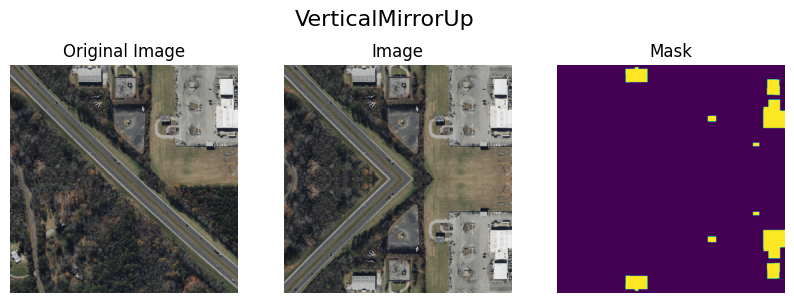
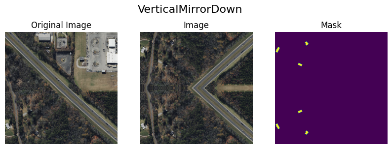
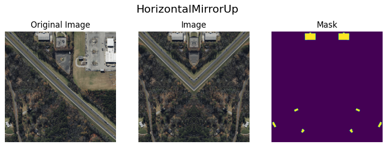
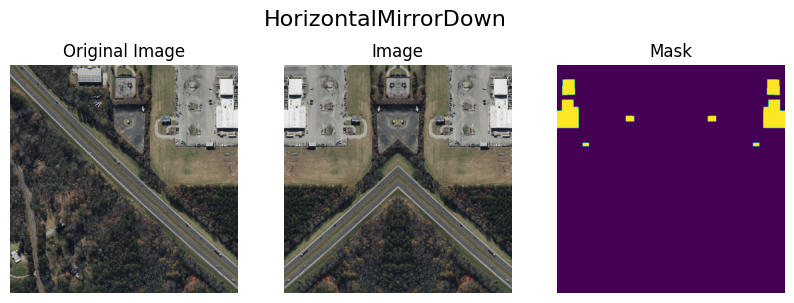
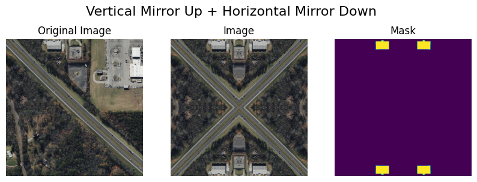

# Albumentations Mirror

## Usage
```
transform = A.Compose([
    VerticalMirrorUp(p=1),
    HorizontalMirrorUp(p=1),
    A.Rotate(limit=90, p=1),
])

output = transform(image=image, mask=mask)
```

## Results





